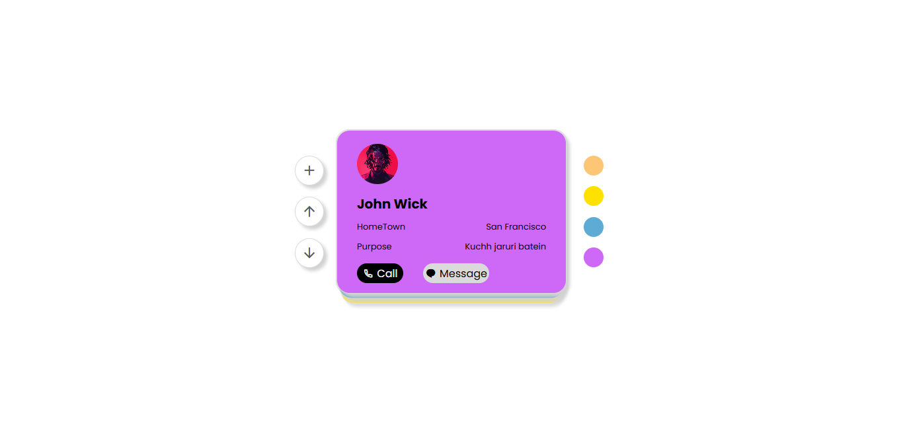
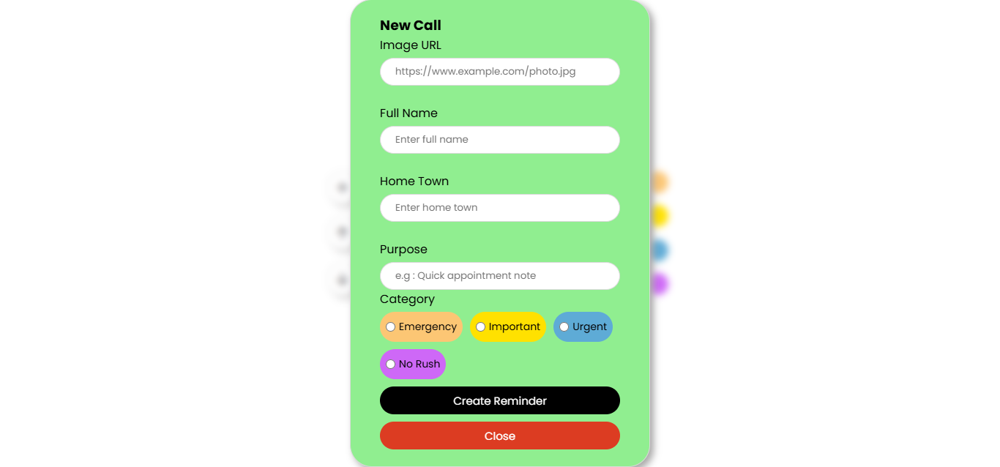

# 📞 Call Reminder App

A simple and interactive **Call Reminder App** built with **HTML, CSS, and JavaScript**.  
This app allows you to create and manage call reminders with details like **name, hometown, purpose, and category**, and stores them locally using **LocalStorage**.  

---

## 🚀 Features

- ➕ **Add new call reminders** with an image, name, hometown, and purpose.  
- 🎨 **Category-based reminders**:  
  - 🟠 Emergency  
  - 🟡 Important  
  - 🔵 Urgent  
  - 🟣 No Rush  
- 📂 **Persistent storage** using **LocalStorage** (data remains after page refresh).  
- 📑 **Stacked card view** with smooth UI.  
- ⬆️⬇️ **Reorder reminders** (move up/down).  
- 📱 Responsive UI (cards and form are styled for a clean look).  

---

## 🖼️ Preview  

Here’s how the app looks 👇  




---

## 🛠️ Tech Stack  

- **HTML5** – structure  
- **CSS3** – styling  
- **JavaScript (Vanilla JS)** – functionality & local storage  
- **Remix Icons** – icons  
- **Google Fonts (Poppins)** – typography  

---

## 📂 Project Structure  

```
Call-Reminder-App/
│── index.html
│── style.css
│── script.js
│── README.md
│── assets/
    └── card.jpg
    └── form.jpg
```

---

## ⚙️ How to Use  

1. Clone this repository:  
   ```bash
   git clone https://github.com/your-username/Call-Reminder-App.git
   ```
2. Open `index.html` in your browser.  
3. Click ➕ to add a new reminder.  
4. Fill in the details and save.  
5. Your reminder will be stored in **LocalStorage** and displayed as a card.  

---

## 📌 Future Improvements  

- ✅ Edit & delete reminders.  
- ✅ Add due dates & notifications.  
- ✅ Mobile-first design with responsive layout.  

---

## 🙌 Contributing  

Contributions are welcome! Feel free to fork this repo and submit a pull request.  

---

## 📜 License  

This project is licensed under the **MIT License**.  

---
